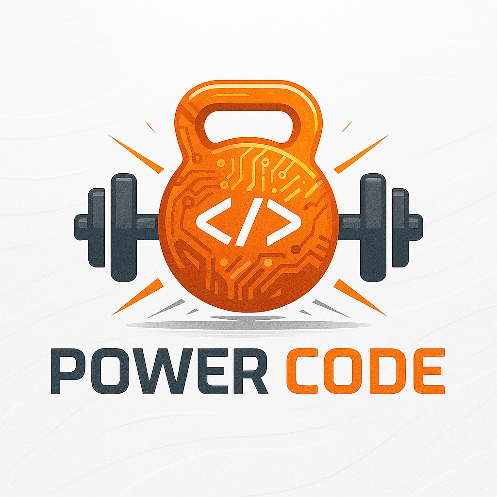
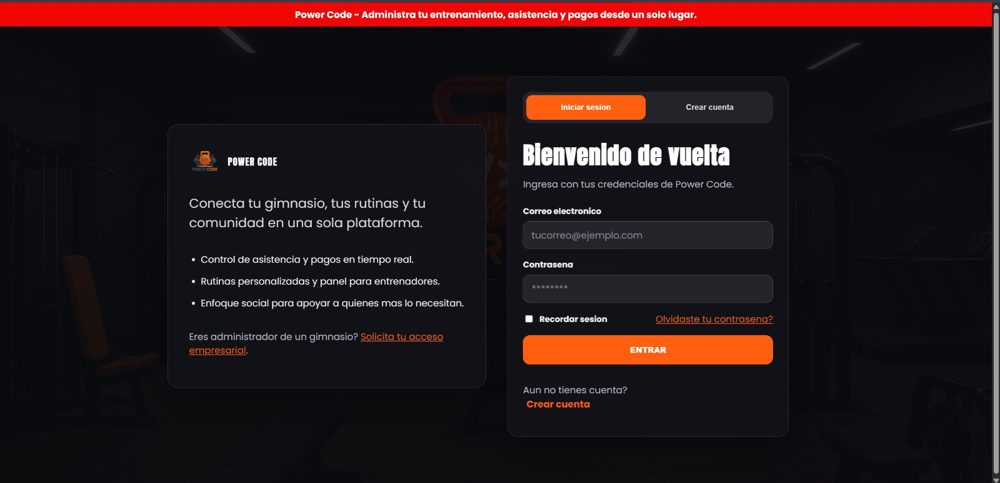
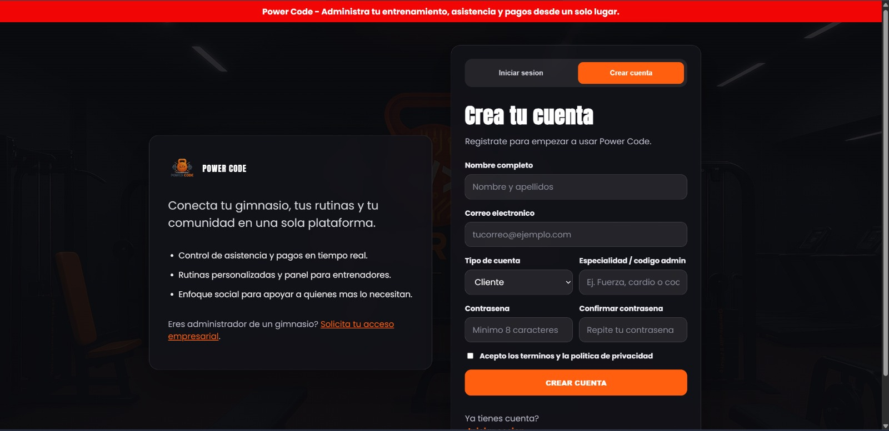
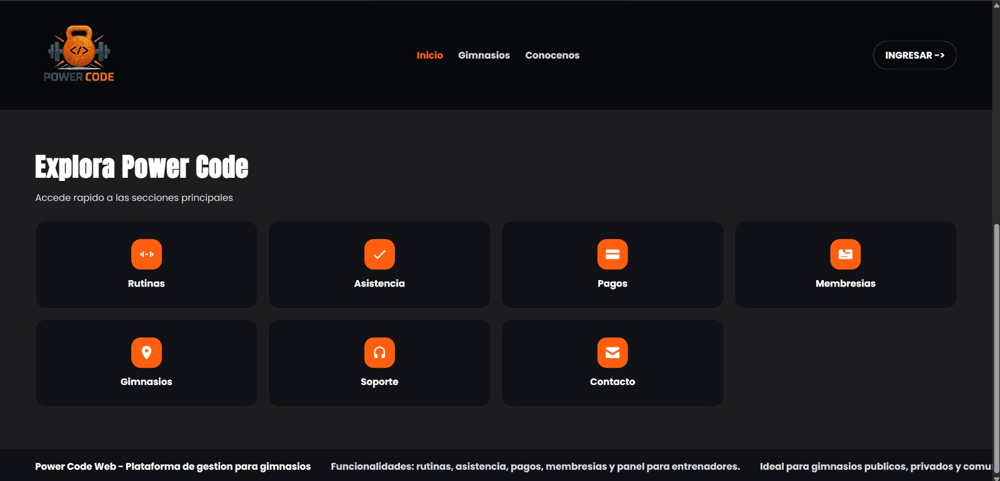
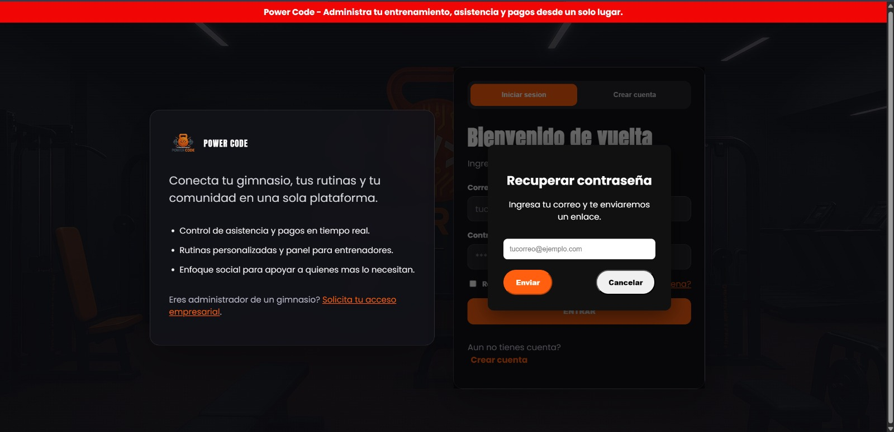
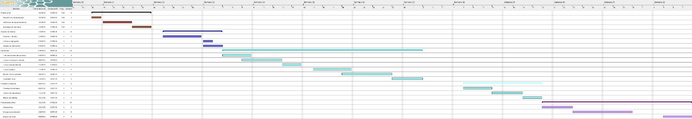
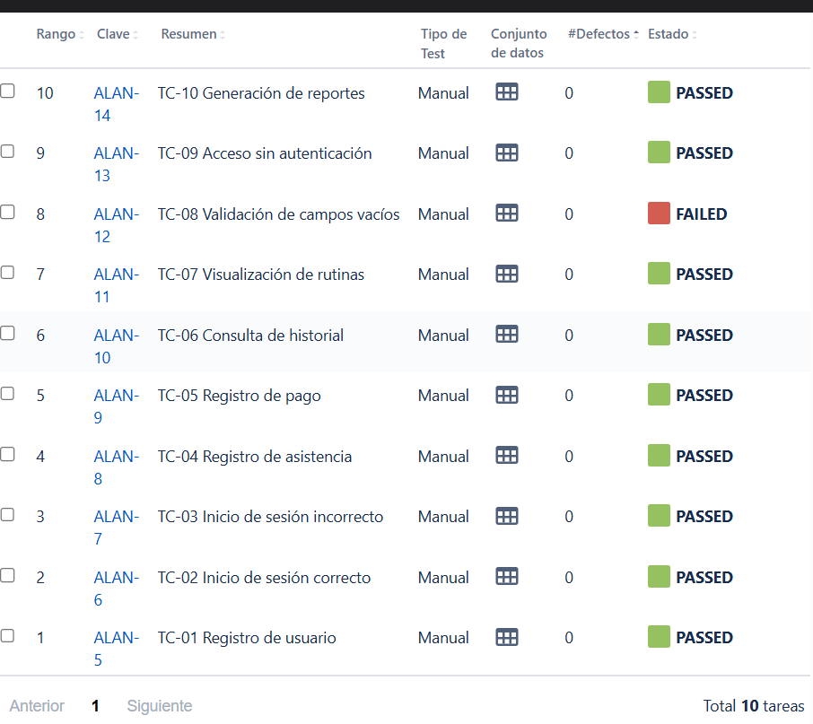

#  Power Code

##   Plataforma Web para Gestión de Gimnasios y Seguimiento Deportivo

Power Code es una aplicación web desarrollada para optimizar la administración de gimnasios, entrenadores y clientes mediante herramientas digitales modernas. El sistema centraliza procesos como registros, rutinas, pagos, asistencias y seguimiento general.

---

#   Identidad Visual

## Logo de la Empresa


## Logo de la Aplicación



---

#   Vista General del Sistema

# Diseño UI/UX

La interfaz fue diseñada previamente en Figma mediante:

- Sketches
- Wireframes
- Mockups
- Prototipo Navegacional

Ver documentación:

docs/uiux/uiux.md

## Inicio de Sesión



## Registro de Usuario



## Menú Principal




## Recuperación de Contraseña



---

#   Tecnologías Utilizadas

| Área                 | Tecnologías                     |
|----------------------|---------------------------------|
| Frontend             | HTML5, CSS3, JavaScript         |
| Backend              | Node.js, Express.js             |
| Base de Datos        | MySQL                           |
| Seguridad            | bcrypt                          |
| Correos              | Nodemailer                      |
| Control de Versiones | Git, GitHub                     |
| Editor de Código     | Visual Studio Code              |
| Navegador de Pruebas | Google Chrome                   |

---

#   Arquitectura General

```text
Frontend (HTML, CSS, JS)
        ↓
Backend (Node.js + Express)
        ↓
Base de Datos (MySQL)
        ↓
Servicios Complementarios (Correo)
```

---

# Planeación del Proyecto



---
#   Roles del Sistema

## Administrador

- Gestión de usuarios
- Administración general
- Control de pagos
- Visualización de reportes

## Entrenador

- Crear rutinas
- Seguimiento de clientes
- Control de progreso

## Cliente

- Consultar rutinas
- Ver historial de pagos
- Registrar asistencia

---

#   Estructura del Proyecto

# Estructura del Proyecto

```text
POWERCODE_APPWEB/
│ README.md
│
├── api/
│   ├── own/
│   └── endpoints/
│
├── backend/
│   ├── config/
│   ├── routes/
│   ├── .env.example/
│   ├── avance-sistema.sql/ 
    ├── confirmacion-cuenta.sql/
    ├── package-lock.json/
│   ├── server.js
│   └── package.json
│
├── frontend/
│   ├── index.html
│   ├── login.html
│   ├── register.html
│   ├── dashboard.html
│   ├── payments.html
│   ├── memberships.html
│   ├── css/
│   ├── js/
│   └── img/
│
└── docs/
    ├── contexto/
    │   └── requerimientos.md
    ├── uiux/
    │   └── uiux.md
    ├── img/
    ├── testing.md
    └── ia-responsiva.md
```

---

#   Instalación del Proyecto

## 1. Clonar repositorio

```bash
git clone https://github.com/BryanJ95-UT/PowerCode_Appweb.git
```

## 2. Instalar dependencias

```bash
cd backend
npm install
```

## 3. Ejecutar servidor

```bash
node server.js
```

---

#   Funcionalidades Principales

- Registro de usuarios
- Inicio de sesión
- Recuperación de contraseña
- Gestión de membresías
- Registro de pagos
- Rutinas deportivas
- Control de asistencias
- Interfaz responsiva

---

# Inteligencia Artificial Aplicada

Se utilizaron herramientas de IA como apoyo para:

- Optimización visual
- Corrección de código
- Mejora documental
- Organización del proyecto

Ver documentación:

docs/iaResponsiva.md

---

#   Testing

Se realizaron pruebas funcionales mediante Jira para validar:

- Registro
- Inicio de sesión
- Pagos
- Accesos
- Campos vacíos
- Navegación del sistema



Documentación completa:

docs/testing.md

---

# Análisis del Sistema

Requerimientos funcionales, no funcionales, reglas de negocio e historias de usuario disponibles en:

docs/contexto/requerimientos.md

---

#   Documentación

El proyecto cuenta con documentación técnica relacionada con:

- Base de datos
- Casos de prueba
- Reporte técnico
- Evidencias del sistema

---

#   Equipo de Desarrollo

Proyecto desarrollado por el equipo **Power Code**.
   -Bryan Javier Gonzales Paredes
   -Emigdio Yait Aguirre Martinez
   -Alan Cruz Baltazar
   -Angel Nazul Gutierrez Cruz

---

#  Estado del Proyecto

Versión Web funcional en mejora continua.

---

#   Licencia

Uso académico.