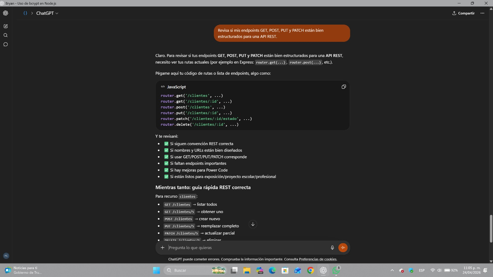
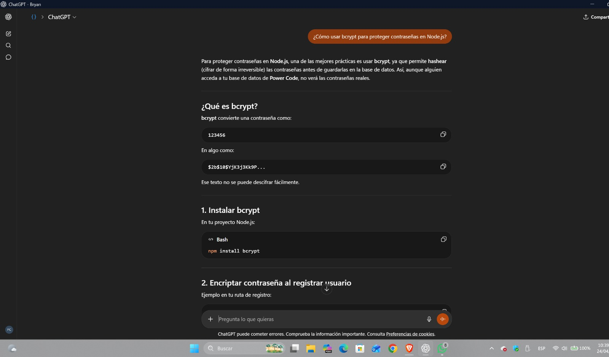
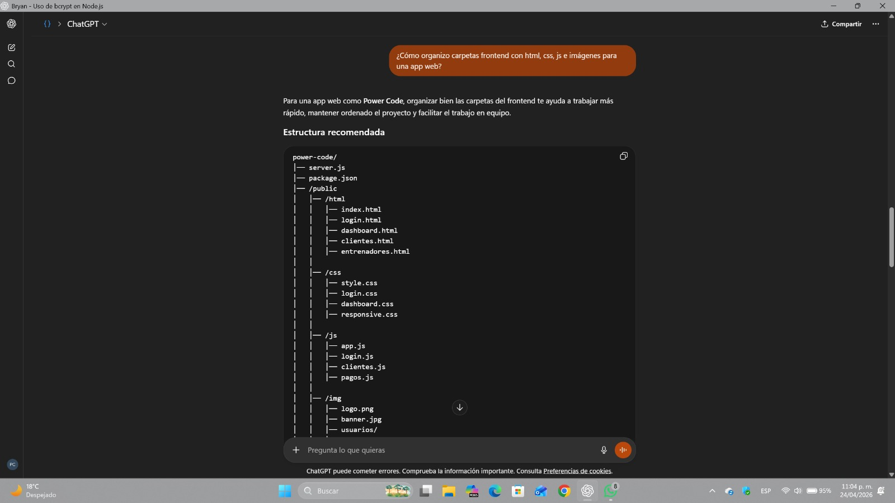
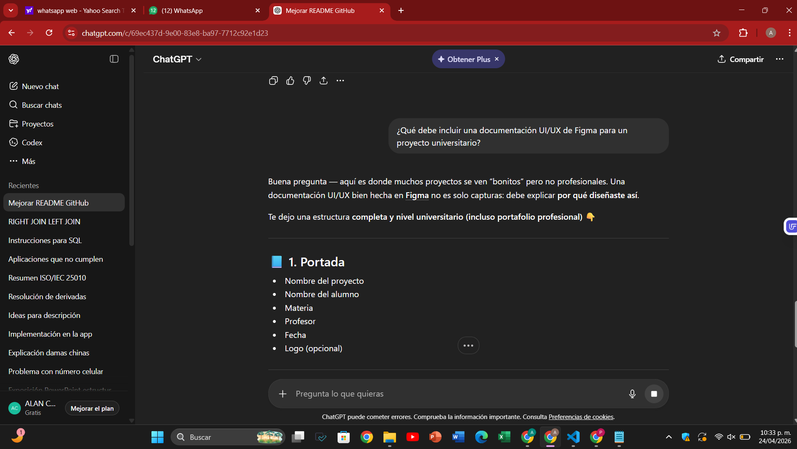
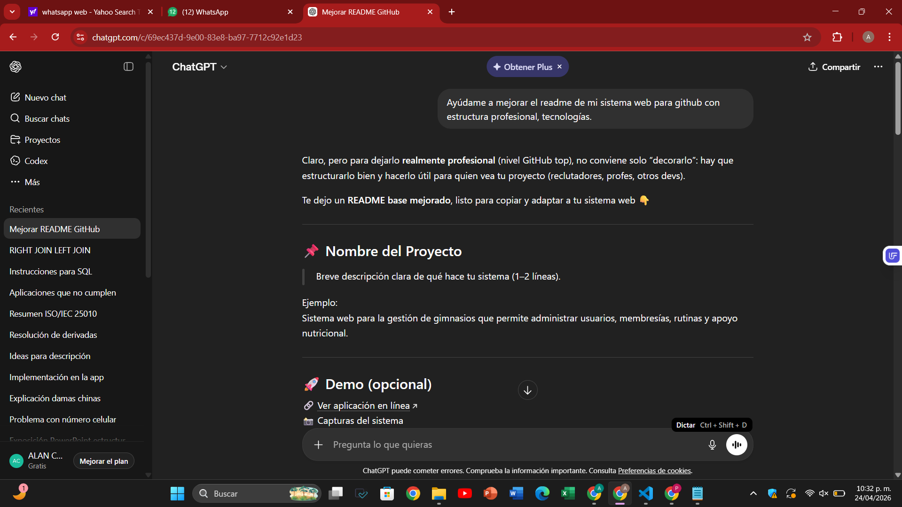

# Bitácora de Uso Responsable de IA 

## Proyecto: Power Code

## Herramienta Utilizada

- ChatGPT (OpenAI)

## Objetivo

Utilizar IA como herramienta de apoyo técnico para mejorar documentación, estructura del proyecto, seguridad, arquitectura y organización del sistema.

---

# Prompt 1 - API REST

## Solicitud realizada:

Revisa si mis endpoints GET, POST, PUT y PATCH están bien estructurados para una API REST.

## Propósito:

Validar que la API propia cumpliera buenas prácticas REST y uso correcto de métodos HTTP.

## Resultado aplicado:

Se mejoró la organización de endpoints dentro de la carpeta `/api/own`, verificando estructura de rutas y respuestas.

---

# Prompt 2 - Seguridad Backend

## Solicitud realizada:

¿Cómo usar bcrypt para proteger contraseñas en Node.js?

## Propósito:

Implementar almacenamiento seguro de contraseñas dentro del sistema.

## Resultado aplicado:

Se utilizó hash de contraseñas antes de guardar usuarios en base de datos.

---

# Prompt 3 - Organización Frontend

## Solicitud realizada:

¿Cómo organizo carpetas frontend con html, css, js e imágenes para una app web?

## Propósito:

Mantener estructura limpia y profesional del frontend.

## Resultado aplicado:

Se reorganizó la carpeta `/frontend` en módulos separados para estilos, scripts, vistas e imágenes.

---

# Prompt 4 - Diseño UI/UX

## Solicitud realizada:

¿Qué debe incluir una documentación UI/UX de Figma para un proyecto universitario?

## Propósito:

Completar la documentación solicitada en la rúbrica referente a sketches, wireframes, mockups y prototipo.

## Resultado aplicado:

Se mejoró el archivo `/docs/uiux/uiux.md` incluyendo evidencias del proceso de diseño.

---

# Prompt 5 - README Profesional

## Solicitud realizada:

Ayúdame a mejorar el README de mi sistema web para GitHub con estructura profesional, tecnologías.

## Propósito:

Presentar correctamente el proyecto en GitHub con imagen institucional y documentación clara.

## Resultado aplicado:

Se rediseñó el README principal agregando secciones técnicas, instalación, estructura del proyecto e imágenes.

---

# Revision del Contenido

Todo contenido generado por IA fue:

- Revisado manualmente
- Adaptado al sistema real Power Code
- Corregido por el equipo
- Integrado según la rúbrica oficial

---

# Conclusión

La Inteligencia Artificial fue utilizada como herramienta de apoyo técnico y productividad para el proyecto y resolucion de dudas