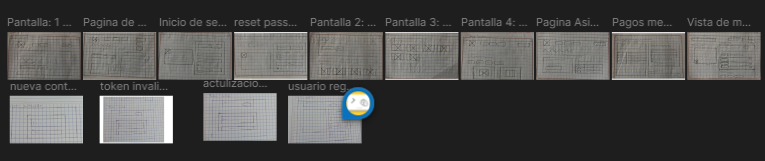
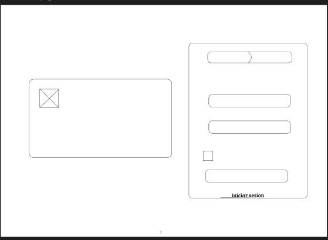
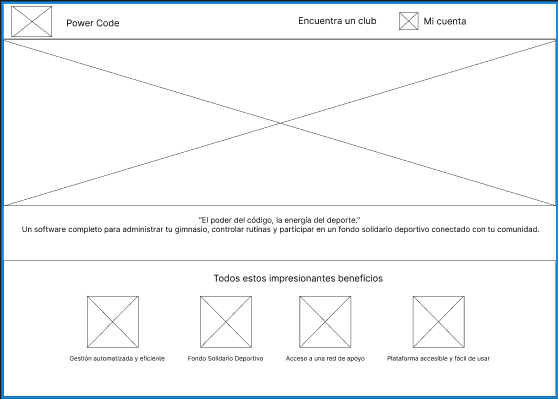
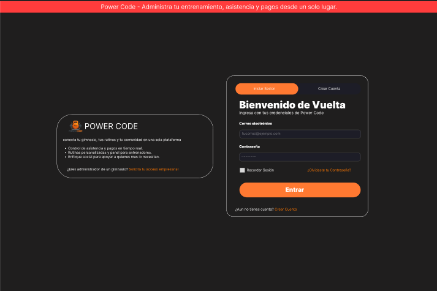
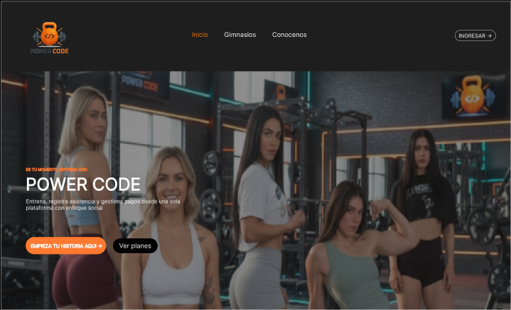
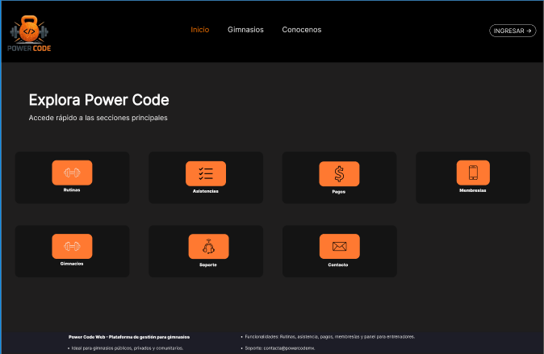
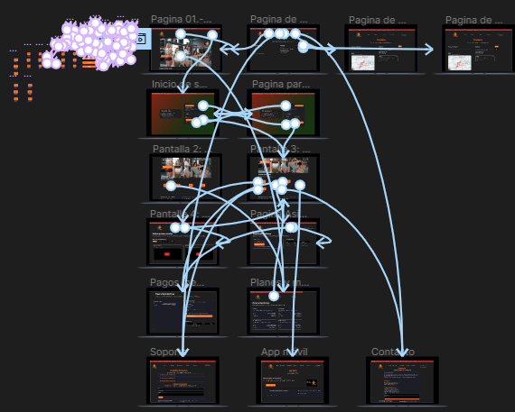

# Diseño de Interfaz UI/UX - Power Code

## Herramienta Utilizada

Figma

## Enlace del Prototipo

https://www.figma.com/design/JdlFKp5sU650dMylMEdRMx/APP-WEB?node-id=1-3&p=f&t=IoH0RT4EMAsFs90M-0

---

# Objetivo del Diseño

Diseñar una interfaz moderna, intuitiva, funcional y responsiva para la plataforma Power Code, enfocada en la administración de gimnasios, clientes, pagos, rutinas deportivas y reportes generales.

El diseño busca facilitar la navegación entre módulos y mejorar la experiencia del usuario final.

---

# Identidad Visual

## Colores Corporativos

- Negro
- Gris oscuro
- Naranja corporativo
- Blanco

## Estilo Visual

- Diseño tipo dashboard moderno
- Tarjetas informativas
- Menú lateral administrativo
- Botones llamativos
- Formularios limpios y ordenados

---

# Etapas de Diseño Desarrolladas

## 1. Sketches

Se realizaron bocetos iniciales para definir distribución general de pantallas, navegación y estructura básica del sistema.

---

## 2. Wireframes

Diseño estructural en baja fidelidad para validar espacios, menús y formularios antes del diseño final.

### Wireframe Login

### Wireframe Dashboard

---

## 3. Mockups Finales

Diseño visual definitivo respetando identidad Power Code y experiencia moderna.

### Mockup Login

### Mockup Dashboard

---

## 4. Prototipo Navegacional

Se desarrolló un flujo interactivo entre pantallas principales del sistema.

Landing Page → Login → Dashboard → Pagos → Rutinas → Reportes

---

# Pantallas Diseñadas

- Landing Page
- Inicio de Sesión
- Registro de Usuario
- Recuperación de Contraseña
- Dashboard General
- Gestión de Clientes
- Gestión de Pagos
- Membresías
- Rutinas
- Panel de Entrenador
- Reportes

---

# Diseño Responsivo

La interfaz fue adaptada para distintos dispositivos:

- Computadora de escritorio
- Laptop
- Tablet
- Teléfono móvil

Se implementó mediante Media Queries en CSS para garantizar correcta visualización.

---

# Relación entre Figma y Frontend Desarrollado

Los diseños creados en Figma fueron utilizados como base directa del frontend implementado en HTML, CSS y JavaScript.

Se respetaron elementos como:

- Distribución visual
- Colores institucionales
- Navegación lateral
- Formularios
- Dashboard administrativo
- Botones y tarjetas visuales

---

# Principios UX Aplicados

## Simplicidad

Interfaz limpia y fácil de entender.

## Consistencia

Uso uniforme de estilos, botones y menús.

## Rapidez

Acceso rápido a módulos importantes.

## Retroalimentación

Mensajes visuales en acciones, errores y registros.

## Accesibilidad

Diseño adaptable y entendible para diferentes usuarios.

---

# Beneficios del Diseño Previo

- Reducción de errores en desarrollo
- Mejor organización visual
- Planeación anticipada del sistema
- Mejor experiencia para usuarios finales

---

# Conclusión

El proceso UI/UX permitió visualizar y estructurar Power Code antes de programarlo, logrando una plataforma moderna, organizada y funcional. El uso de Figma facilitó la conexión entre diseño y desarrollo frontend real.